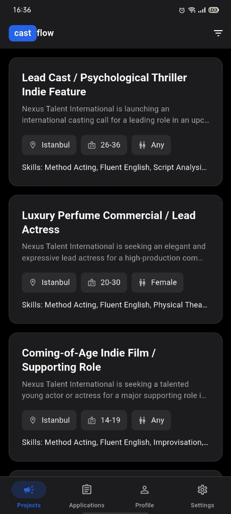
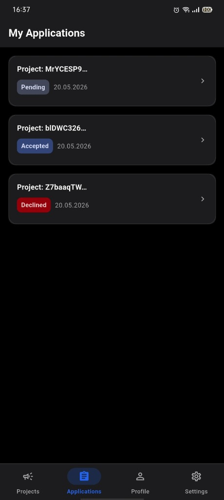
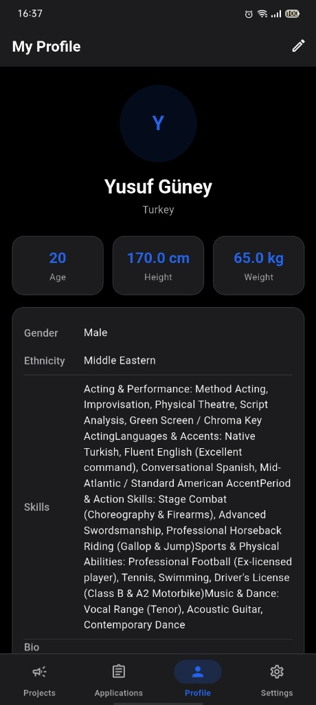
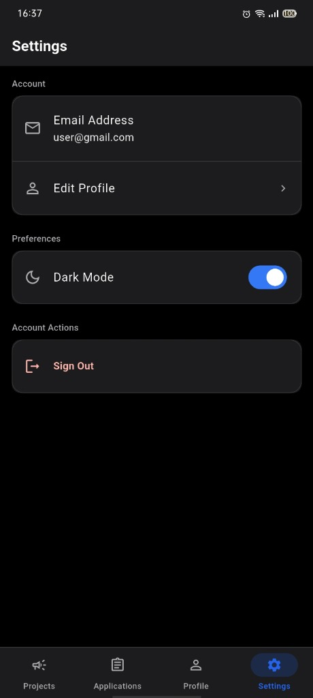

# 🎬 Castflow - Oyuncu & Ajans Yönetim Platformu

Castflow, oyuncuların (Actors) kast projelerini inceleyip başvuru yapabildiği, ajansların (Agencies) ise kast ilanları oluşturup başvuruları yönetebildiği modern, iki taraflı bir mobil yönetim platformudur. Flutter ve Firebase tabanlı geliştirilmiştir.

---

## 📱 Uygulama Ekran Görüntüleri

| Projeler | Başvurularım | Profilim | Ayarlar |
|:---:|:---:|:---:|:---:|
|  |  |  |  |

---

## 👨‍🎓 Öğrenci Bilgileri
* **Öğrenci Adı ve Soyadı:** Yusuf Güney
* **Öğrenci Numarası:** 243301076

---

## 🔑 Test Hesabı Bilgileri
Uygulamayı hızlıca test edebilmeniz için hazır roller tanımlanmış test hesapları aşağıdadır:

### 🎭 Aktör (Oyuncu) Test Hesabı
* **E-posta:** `user@gmail.com`
* **Şifre:** `123456`

### 🏢 Ajans (Kast Ajansı) Test Hesabı
* **E-posta:** `agency@gmail.com`
* **Şifre:** `123456`
> 💡 **Not:** Uygulamanın kayıt ekranından (Register Page) saniyeler içerisinde kendi e-posta adresinizle yeni bir Aktör veya Ajans hesabı da oluşturabilirsiniz.

---

## 🛠️ Kullanılan Paketler (Dependencies)
Projede kullanılan tüm üçüncü taraf paketler ve sürümleri:

* **Çekirdek & Durum Yönetimi:**
  * `flutter_riverpod` (^3.3.1) - Modern, tip güvenli ve performanslı durum yönetimi (State Management).
  * `go_router` (^17.2.3) - Rol tabanlı sayfa korumaları (Guard) ve deklaratif yönlendirme yönetimi.
  * `shared_preferences` (^2.5.5) - Tema tercihi (koyu/açık mod) gibi basit ayarların yerel cihazda saklanması.

* **Firebase Entegrasyonu (Arka Plan Servisleri):**
  * `firebase_core` (^4.8.0) - Firebase ekosisteminin başlatılması.
  * `firebase_auth` (^6.5.0) - Rol tabanlı güvenli kimlik doğrulama (Authentication).
  * `cloud_firestore` (^6.4.0) - Gerçek zamanlı (Real-time) NoSQL doküman veritabanı.
  * `firebase_storage` (^13.4.0) - Oyuncu profil resimlerinin bulutta saklanması.

* **Arayüz ve Kullanıcı Deneyimi (UI/UX):**
  * `csc_picker_plus` (^0.0.3) - Ülke, eyalet ve şehir seçimi sağlayan gelişmiş konum seçici bileşeni.
  * `image_picker` (^1.2.2) - Kameradan veya galeriden profil resmi seçme desteği.
  * `cupertino_icons` (^1.0.8) - iOS tarzı simgelerin kullanımı için tasarım kütüphanesi.

---

## 🚀 Kurulum ve Çalıştırma Adımları

Projeyi klonladıktan sonra uygulamanın **APK** çıktısını alıp **Android Emülatörde** çalıştırmak için aşağıdaki adımları sırasıyla uygulayınız:

### 1. Depoyu Klonlama ve Bağımlılıkları Yükleme
```bash
# Projeyi yerel makinenize indirin:
git clone https://github.com/yusufgney/243301076_yusufguney_flutter_proje.git

# Proje dizinine geçiş yapın:
cd 243301076_yusufguney_flutter_project

# Gerekli Flutter paketlerini indirin:
flutter pub get
```

### 2. Android Emülatörünü Başlatma
```bash
# Bilgisayarınızda tanımlı emülatörlerin listesini alın:
flutter emulators

# Listelenen emülatörlerden birini başlatın (Örn: emulator_id = Nexus_5X_API_29):
flutter emulators --launch <emulator_id>
```

### 3. Uygulamayı APK Haline Getirme (Derleme)
```bash
# Hata ayıklama (Debug) modunda APK derlemek için:
flutter build apk --debug

# (Veya) Yayınlanabilir (Release) modda APK derlemek için:
flutter build apk --release
```
*Derleme tamamlandığında APK dosyanız şu dizinde oluşturulacaktır:*  
`build/app/outputs/flutter-apk/app-debug.apk` (veya `app-release.apk`)

### 4. APK'yı Emülatöre Yükleme ve Başlatma
```bash
# Adım 2'de başlattığınız emülatörün ID'sini öğrenmek için cihaz listesini kontrol edin:
flutter devices

# Oluşturulan APK dosyasını doğrudan emülatöre yükleyip çalıştırmak için:
flutter run -d <emulator_id> --use-application-binary build/app/outputs/flutter-apk/app-debug.apk
```
*Bu komut, derlenmiş olan APK dosyasını emülatörünüze yükleyecek ve uygulamayı otomatik olarak başlatacaktır.*

---

## 📄 Lisans
Bu proje MIT Lisansı ile lisanslanmıştır. Detaylar için `LICENSE` dosyasına göz atabilirsiniz.
